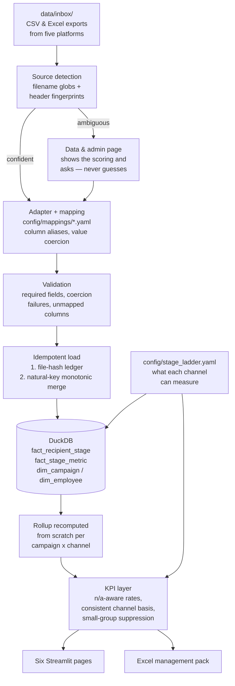

# Campaign Communication Effectiveness Dashboard

An on-premises dashboard for gauging how well internal communication campaigns actually land,
across five platforms that each measure something different: **Email**, **WhatsApp**, a **Learning
Management tool**, **MS Teams webinars**, and **Viva Engage**.

Export from each platform, drop the files into a folder, and the dashboard normalises them into one
funnel — Targeted → Delivered → Opened → Engaged → Completed — and reports management KPIs on
workforce reach, awareness and adoption. It runs entirely inside your network: **no cloud services,
no outbound calls at runtime, no telemetry.**

It ships with synthetic sample exports, so it demonstrates itself before any company data is
involved.

## Stack

| Layer | Tool |
|---|---|
| UI | [Streamlit](https://streamlit.io) 1.41 |
| Warehouse | [DuckDB](https://duckdb.org) — one embedded file, no server, no admin rights |
| Charts | [Plotly](https://plotly.com/python/) via `st.plotly_chart` (plotly.js is bundled inside Streamlit's own static assets — no CDN) |
| Ingestion | pandas + openpyxl, driven by editable YAML column mappings |
| Export | XlsxWriter, using native Excel charts (no headless browser needed) |
| Tests | pytest — 116 tests, including an assertion that the whole pipeline runs with every socket blocked |

Everything is a pure pip wheel. Nothing here needs a database server, a browser engine, or
administrator privileges on the host.

## Architecture



**Why two fact tables.** Four of the five platforms export one row per person. Viva Engage exports
one row per *post* — there are no people in its data at all. A single per-recipient table cannot
represent it, and a single long event table makes "did this person ever open" expensive. So
recipient rows land in `fact_recipient_stage`, everything is rolled up into `fact_stage_metric`, and
every page reads the rolled-up shape. An aggregate-only channel is then a first-class citizen rather
than a special case smeared through the UI.

## The idea that shapes everything: n/a is not zero

Email has no completion step. An LMS assignment has no delivery step. A Teams attendance report
carries no invitation telemetry. If those are stored as `0`, the combined funnel shows a dramatic
collapse at Completed that is pure artefact, and a completion rate that is arithmetically fine and
completely meaningless.

So every `(channel, stage)` pair carries one of three states:

| State | Meaning | Shown as |
|---|---|---|
| **measured** | the platform reports it and the export carried it | the number |
| **not applicable** | the platform has no such concept | `n/a` |
| **not measured** | the platform supports it, but *this export* omitted it | `not measured` |

Unmeasurable stages are excluded from **both** the numerator and the denominator of any rate they
would appear in — never zero-filled. Alongside that, every value is tagged as counting **persons**
or **events**, because Viva Engage's reactions are interactions, not people (one person can react
*and* comment on the same post), and dividing events by an audience size is not a percentage of
anything.

The stage matrix lives in [`config/stage_ladder.yaml`](config/stage_ladder.yaml). Editing that file
changes every number and label in the dashboard, with no code change.

| Canonical stage | Email | WhatsApp | LMS | Teams webinar | Viva Engage |
|---|---|---|---|---|---|
| **Targeted** | sent | sent | assigned | invited | community size *(largest, not summed)* |
| **Delivered** | delivered | delivered | *n/a* | *n/a* | *n/a* |
| **Opened** | unique opens | read | started | registered | unique viewers *(lower bound)* |
| **Engaged** | unique clicks | replied or tapped | progressed / attempted | attended | reactions + comments + shares *(**events**)* |
| **Completed** | *n/a* | *n/a* | completed and passed | attended past the threshold | *n/a* |

## Repo layout

```
campaign-effectiveness-dashboard/
├── README.md                            ← you are here
├── run.sh / run.bat                     ← one-command start
├── requirements.txt                     ← pinned; requirements-dev.txt adds pytest
├── app/
│   ├── main.py                          ← entrypoint: navigation, shared filters
│   ├── data_access.py                   ← cached query layer (see the cache note below)
│   ├── views/                           ← the six pages
│   └── components/                      ← theme, charts, KPI tiles, filter sidebar
├── comms_dashboard/
│   ├── config.py, models.py, db.py      ← config loading, core types, DuckDB
│   ├── ingest/
│   │   ├── base.py                      ← the generic YAML-driven mapping engine
│   │   ├── adapters/                    ← one per source; only the bespoke bits
│   │   ├── loader.py                    ← idempotent load + rollup recompute
│   │   └── cli.py                       ← headless ingestion
│   ├── metrics/                         ← KPI definitions, coverage, RAG
│   └── export/excel.py                  ← the management pack
├── config/
│   ├── settings.yaml                    ← paths, targets, privacy, date order
│   ├── stage_ladder.yaml                ← what each channel can measure
│   └── mappings/*.yaml                  ← YOUR column headers go here
├── sql/01_schema.sql, 02_views.sql
├── data/samples/                        ← synthetic exports, incl. edge cases
├── docker/                              ← Dockerfile + compose
├── docs/                                ← mapping guide, KPI definitions, operations
└── tests/                               ← 116 tests
```

## Setup

### Step 1 — Install

**Connected machine:**

```bash
cd campaign-effectiveness-dashboard
./run.sh            # creates .venv, installs, and starts the dashboard
```

**Air-gapped server** — build the bundle on a connected machine that matches the target's Python
version and platform, copy the project across, then install with no index:

```bash
./scripts/build_wheelhouse.sh                   # on the connected machine
# …transfer the project including wheelhouse/…
pip install --no-index --find-links=wheelhouse -r requirements.txt
```

`run.sh` picks the wheelhouse up automatically if it is present.

> Requires Python 3.11 or newer. This project was built and tested against 3.11.

### Step 2 — See it working with the sample data

```bash
python -m comms_dashboard.ingest.cli load --samples
streamlit run app/main.py
```

Then open <http://localhost:8501>. Or skip the CLI: start the app, go to **Data & admin**, and press
**Copy sample exports into the inbox** followed by **Load everything in the inbox**.

### Step 3 — Connect your own exports

This is the whole configuration job, and it is a YAML edit rather than a code change.

1. Export from each platform and drop the files into `data/inbox/`.
2. Open **Data & admin**. Each file shows what the app thinks it is, which of your columns it
   matched, and which it ignored.
3. For anything it could not match, add your real column header to the `aliases` list in
   `config/mappings/<source>.yaml`. Matching ignores case, spaces and punctuation, so
   `Unique Opens`, `unique_opens` and `UNIQUE-OPENS` all hit the same alias.
4. Press **Load everything in the inbox**.

Two things to get right before the first real load:

- **`parsing.date_order` in `config/settings.yaml`.** `03/04/2026` is genuinely ambiguous. The app
  will not guess — set `DMY` or `MDY` to match your exports. Guessing per-file is the most common
  silent data corruption in tools like this.
- **Load a campaign registry and an employee roster first.** The registry supplies campaign names,
  owners and targets the platform exports do not carry. The roster is what lets a WhatsApp phone
  number and an LMS login be recognised as the same person — without it, coverage analysis and
  cross-channel deduplication are unavailable (and say so, rather than silently guessing).

See [`docs/mapping_guide.md`](docs/mapping_guide.md) for the full field reference.

### Step 4 — Deployment

```bash
docker compose -f docker/docker-compose.yml up -d
```

`data/` and `config/` are bind-mounted, so drops, the warehouse and your mappings all survive an
image upgrade. For an air-gapped host, build the image on a connected machine and transfer it:

```bash
docker build -f docker/Dockerfile -t comms-dashboard:1.0 .
docker save comms-dashboard:1.0 | gzip > comms-dashboard-1.0.tar.gz
# …copy across…
docker load < comms-dashboard-1.0.tar.gz
```

> **Not verified here.** The environment this project was built in cannot reach Docker Hub, so the
> image build was never executed — the compose file parses and the Dockerfile is written against the
> same install path the wheelhouse route uses (which *was* verified end to end), but treat the first
> `docker build` as untested. The `./run.sh` route is fully exercised.

In production, prefer running ingestion from cron or Task Scheduler rather than from the UI:

```bash
python -m comms_dashboard.ingest.cli load
```

DuckDB permits a single writer, so a scheduled load does not compete with someone browsing for the
write lock. A commented-out `loader` service in `docker-compose.yml` does this on an hourly loop.

## The pages

| Page | What it answers |
|---|---|
| **Executive overview** | Did the message land? Headline KPIs with RAG status, the combined funnel, channels side by side, engagement over time, a campaign leaderboard, and the Excel export. |
| **Channel deep dive** | One channel in its own vocabulary, with its native stage names, its detractors (bounces, opt-outs), and its own distributions — webinar dwell time, LMS score spread, Viva reaction mix. |
| **Campaign comparison** | Campaigns side by side, against target, with a guardrail that warns when the selected campaigns are not like for like. |
| **Audience & coverage** | Which parts of the workforce were reached and which were missed, by department, region, grade or site — with disclosure control applied. |
| **Data & admin** | The plug & play control panel: what is in the inbox, what the app thinks each file is, the column mapping preview, the load history and every warning. |
| **Definitions & settings** | Every formula, every caveat, the stage matrix, the targets and the privacy controls in force. |

## KPI definitions

Full detail is on the in-app Definitions page and in
[`docs/kpi_definitions.md`](docs/kpi_definitions.md); the headline set:

| KPI | Formula | Note |
|---|---|---|
| Delivery rate | delivered / targeted | n/a where there is no delivery step |
| Open / view rate | opened / **delivered** | measured against delivered, so a delivery failure is not scored as disinterest |
| Engagement rate | engaged / **delivered** | the headline measure — far less corrupted by tracking artefacts than open rate |
| Completion rate | completed / **targeted** | against everyone assigned, because that is the population management owns |
| Attendance rate | attended / **registered** | shown separately from registration rate and show-up rate, which are chronically conflated |
| Workforce coverage | distinct employees reached / in-scope headcount | needs the roster; degrades visibly without it |
| Channel effectiveness index | 0–100 weighted composite | renormalised across only the rates a channel supports, and scoped to **within** one campaign |

**Cross-channel rates use a consistent basis.** Both sides of a headline rate are restricted to the
channels that measure *both* stages. Summing every channel's opens and dividing by every channel's
deliveries mixes two different populations — against the bundled sample data that produces an open
rate of 126%, which is visibly wrong; against real data it would produce something merely plausible
and still wrong. Each headline tile names the channels it is based on.

## Testing

```bash
pip install -r requirements-dev.txt
pytest -q            # 116 tests, ~50s
```

The suite is organised around the claims that would be most damaging to get wrong:

| File | Protects |
|---|---|
| `test_normalize.py` | blank cells stay unknown and never become `False`; date order comes from config, never inference |
| `test_detection_and_adapters.py` | each sample detects as its own source; the ambiguous file is refused rather than guessed; per-channel derivations (dwell-time completion, read-receipt opens, assessment-gated completion) |
| `test_idempotency.py` | a byte-identical re-drop is skipped; a **superset** re-export does not double-count; a known open never regresses when a thinner export is loaded; rollups are recomputed, not accumulated |
| `test_kpis.py` | n/a semantics, events never divided by people, the consistent cross-channel basis, dedupe availability |
| `test_privacy_and_offline.py` | no direct identifier survives ingestion; small-group and complementary suppression; **the whole pipeline runs with every socket blocked** |
| `test_config_and_export.py` | config validation messages name the offending key; the Excel pack writes "n/a" as words and carries no person-level rows |

## Security notes

This dashboard processes employee-level engagement data. Read this section before go-live.

- **Nothing leaves the machine at runtime.** No API calls, no CDN assets, no telemetry. Streamlit's
  usage statistics are disabled in `.streamlit/config.toml`, DuckDB's extension autoloading (which
  downloads on first use) is disabled at connect, and emoji page icons are deliberately avoided
  because Streamlit renders them by fetching a PNG from a CDN. `test_privacy_and_offline.py`
  asserts this by running the pipeline with `socket.socket` monkeypatched to raise.
- **Hashing is pseudonymisation, not anonymisation.** Identifiers are replaced with a keyed
  HMAC-SHA256 digest using a salt held outside git and outside the image. Be clear about what that
  buys: someone who knows your email convention can hash a name list and match it. The stored data
  remains personal data under GDPR/DPDP and comparable regimes. It reduces casual exposure; it does
  not discharge your obligations.
- **Aggregate-only display.** Breakdowns below `privacy.min_group_size` (default 5 — raise it to 10
  for grade or manager cuts) are suppressed. **Complementary suppression** hides a second group when
  only one would otherwise be hidden, because a single hidden value is recoverable by subtracting
  the visible ones from the total. There is no individual drill-down.
- **Streamlit has no authentication.** Anyone who can reach port 8501 sees every campaign. The
  default binding is `127.0.0.1`. Put it behind your internal reverse proxy with SSO before sharing
  it beyond the comms team.
- **The archive folder holds raw exports in plaintext**, complete with real email addresses and
  phone numbers. Give `data/archive/` the same access controls as an HR file share, and enforce
  `privacy.retention_months`. All of `data/` is gitignored.
- **Get employee-relations sign-off.** Measuring individual employees' engagement with internal
  communications is consultable or restricted in several jurisdictions — EU works councils in
  particular. The dashboard supports aggregate-only operation, but the policy call is yours.

## Honest limitations

These are real and they are in the product, not just the documentation — the UI states each one at
the point where it would otherwise mislead.

1. **"Plug & play" is bounded.** Real exports vary far more than any fixed parser expects. The YAML
   mapping and the admin preview make onboarding a config exercise rather than a code change, but
   expect one mapping session per platform against a real export. The design optimises for that
   being fast, not for it being unnecessary.
2. **The combined funnel is a *message* funnel unless a roster is loaded.** On the default "sum of
   channels" basis, someone reached by both email and WhatsApp counts twice. The people-level basis
   requires identity resolution and is offered only when at least two channels match the roster
   well; otherwise the option is disabled with the reason shown.
3. **Email open rate is structurally unreliable.** Apple Mail Privacy Protection pre-fetches
   tracking pixels (inflating opens), Outlook image blocking suppresses them (deflating opens), and
   corporate link scanners click every URL (inflating clicks). Lead with engagement.
4. **WhatsApp read receipts can be switched off** by the recipient, understating reads by an amount
   the export cannot reveal.
5. **Viva Engage cannot contribute to coverage.** It reports per post, so there are no people in its
   data to deduplicate, and its reach figure is a lower bound — post-level data cannot tell whether
   the same person saw two posts, so the largest single post's unique viewers is used rather than a
   sum that would claim several times the workforce.
6. **The trend line tracks campaign launches**, not trickling engagement: every stage for a person is
   attributed to the period the campaign reached them, so that all five stages of a campaign share
   one denominator.
7. **Manual exports mean stale data.** This is a weekly or monthly management reporting tool, not a
   real-time one. The freshness banner and load ledger exist to keep that honest.
8. **Getting the exports may be the hard part.** Viva Engage analytics are community-level and
   admin-gated; Teams attendance reports are per-event downloads by the organiser; and WhatsApp only
   exports at all if you broadcast through a Business API provider — consumer WhatsApp has no export.
   Obtain one real redacted export per channel before hardening any mapping.

## Deliverables checklist

- [x] On-premises dashboard covering all five platforms (`app/`, six pages)
- [x] Plug & play ingestion from company exports — YAML column mapping, source auto-detection,
      admin preview, idempotent loading (`comms_dashboard/ingest/`, `config/mappings/`)
- [x] Management KPIs: reach & engagement funnel per channel and combined, coverage, RAG against
      targets (`comms_dashboard/metrics/`)
- [x] Works with zero company data — synthetic exports for all five channels plus edge cases
      (`data/samples/`)
- [x] Management-ready export (`comms_dashboard/export/excel.py`)
- [x] Deployment for air-gapped environments — wheelhouse **(verified)**, Docker **(untested here)**
- [x] Test suite, 116 tests including an executable no-network guarantee (`tests/`)
- [x] Documentation: this file plus `docs/`
