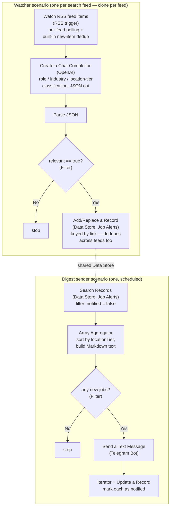

# Job Alert → Telegram Assistant

A no-code [Make](https://www.make.com) automation that watches for open roles
matching a target profile, uses an LLM to decide which postings are actually
relevant (role, industry, and location fit), and pushes a formatted digest
straight into a Telegram chat — no manual job-board checking.

Built for this profile:
- **Roles**: VP / AVP Account Management *or* VP / AVP Transformation, in Life
  Insurance — **or** Business Head, in Travel & Hospitality.
- **Location priority**: Delhi NCR → rest of India → UAE → Australia → any other
  country that commonly accepts Indian nationals at this seniority.

Everything role- and location-specific lives in two places, so you can retarget
this for a different profile without touching the scenario structure:
[`make/relevance_classifier_prompt.md`](make/relevance_classifier_prompt.md)
(the LLM's screening criteria) and
[`docs/search_queries.md`](docs/search_queries.md) (the search queries feeding it).

## Stack

| Layer | Tool |
|---|---|
| Orchestration / schedule | [Make](https://www.make.com) (formerly Integromat) |
| Job discovery | [Google Alerts](https://www.google.com/alerts) RSS (primary — covers LinkedIn, Naukri, iimjobs, etc.) + Indeed regional RSS (optional secondary) |
| Relevance screening | OpenAI (`gpt-4o-mini` or similar) |
| Dedup / fan-in storage | Make's built-in Data Store |
| Delivery | [Telegram Bot API](https://core.telegram.org/bots) |

## Architecture

This is built as **two kinds of Make scenario**, not one giant scenario:



Why this shape, not one scenario looping over every feed:
- **`Watch RSS feed items` already handles fetching, parsing, and per-feed
  new-item dedup natively** — reusing it means this project doesn't need a
  hand-rolled XML parser or dedupe cache, either of which would otherwise
  need a scripting module Make doesn't guarantee on every plan.
- **Fanning results into a shared Data Store, then sending from one place**,
  gives one combined, location-sorted Telegram digest instead of a separate
  ping per feed per poll.
- **Adding a new search later is "clone a watcher scenario, change the feed
  URL"** — nothing shared needs to change, and a dead/broken feed can only
  ever break its own scenario, never the others.
- **The LLM does the fine-grained filtering, not the search queries** — the
  Google Alerts queries are intentionally broad; precision comes from
  [`relevance_classifier_prompt.md`](make/relevance_classifier_prompt.md),
  which is where role/industry/location rules actually live.

There's no importable blueprint `.json` here — see
[`make/build_guide.md`](make/build_guide.md) for why, and for the full
module-by-module build path, which is the authoritative source for this
project.

## Repo layout

```
job-alert-telegram-assistant/
├── README.md                                  ← you are here
├── make/
│   ├── build_guide.md                          ← module-by-module setup for both scenario types
│   ├── relevance_classifier_prompt.md          ← LLM system/user prompt, verbatim
│   ├── classification_json_schema.json         ← Parse JSON module's data structure (paste into Make's "Generate")
│   └── feed_urls.md                            ← every watcher scenario to build/clone, with its feed URL
└── docs/
    ├── search_queries.md                       ← Google Alerts setup + exact query strings, Indeed RSS reference
    ├── sample_alert_message.md                 ← what the Telegram message looks like
    └── troubleshooting.md
```

## Setup

### Step 1 — Telegram bot

1. In Telegram, message **[@BotFather](https://t.me/BotFather)** →
   `/newbot` → follow the prompts → copy the **bot token** it gives you
   (looks like `123456789:AAExampleTokenxxxxxxxxxxxxxxxxxxxxxxx`).
2. Search for your new bot by the username you gave it and send it any message
   (e.g. `/start`) — a bot can't message you until you've messaged it first.
3. Get your **chat ID**: open
   `https://api.telegram.org/bot<YOUR_TOKEN>/getUpdates` in a browser right
   after step 2, and read the numeric `"chat":{"id": ...}` value from the JSON
   response. (Alternative: message **[@userinfobot](https://t.me/userinfobot)**
   and it replies with your ID directly.)

### Step 2 — Google Alerts (job discovery)

Follow [`docs/search_queries.md`](docs/search_queries.md) to create the two
Google Alerts (one for Life Insurance VP roles, one for Travel/Hospitality
Business Head roles) with **Deliver to: RSS feed**, and copy each alert's RSS
feed URL.

### Step 3 — Build the Make scenarios

Follow [`make/build_guide.md`](make/build_guide.md) end to end:
1. Create the shared `Job Alerts` Data Store, Telegram Bot connection, and
   OpenAI connection.
2. Build one **watcher scenario** fully (RSS trigger → OpenAI classifier →
   Parse JSON → Filter → Data Store write), then clone it per
   [`make/feed_urls.md`](make/feed_urls.md) for the rest of the feeds.
3. Build the **digest sender scenario** (Data Store search → aggregate/sort →
   Filter → Telegram send → mark notified).
4. Activate everything and run the end-to-end test at the bottom of the
   build guide.

### Step 4 — Retargeting for a different profile

Everything specific to this candidate's roles/industries/locations lives in
two files — edit these, not the scenario structure, if priorities change:
- [`make/relevance_classifier_prompt.md`](make/relevance_classifier_prompt.md)
  — candidate profile, target role definitions, location tiers.
- [`docs/search_queries.md`](docs/search_queries.md) /
  [`make/feed_urls.md`](make/feed_urls.md) — the Google Alerts query strings
  and Indeed RSS query parameters.

## Sample output

See [`docs/sample_alert_message.md`](docs/sample_alert_message.md) for what a
Telegram alert looks like, grouped by location priority.

## Security & cost notes

- The bot token and chat ID identify a private Telegram chat — keep the Make
  connection private; anyone with the token can send messages as your bot.
- Each new, deduped posting costs one LLM call (`gpt-4o-mini` pricing is cents
  per hundred calls) — the `Watch RSS feed items` trigger's own new-item-only
  emission keeps this bounded to genuinely new postings, not everything in
  the feed on every poll.
- Make's free/starter plans cap monthly **operations** (each module execution
  counts as one) — with N watcher scenarios polling every 6 hours plus one
  digest sender, budget roughly `N × 4 runs/day × ~4 ops/run` even on quiet
  days (the RSS trigger check itself is an op), so start with the two
  required Google Alerts watchers before adding every optional Indeed feed.
- Google Alerts and Indeed RSS are both public, unauthenticated endpoints —
  no API keys to leak, but also no SLA; treat missed or delayed alerts as a
  possibility, not a guarantee, for anything time-sensitive.

## Deliverables checklist

- [x] Scheduled Make automation covering discovery → dedupe → LLM relevance
      screening → Telegram delivery (`make/`)
- [x] Profile-specific search queries and screening criteria, isolated from
      scenario structure for easy retargeting (`docs/search_queries.md`,
      `make/relevance_classifier_prompt.md`)
- [x] Documentation: Telegram bot setup, Google Alerts setup, module-by-module
      build guide, troubleshooting guide (this file + `make/`, `docs/`)
