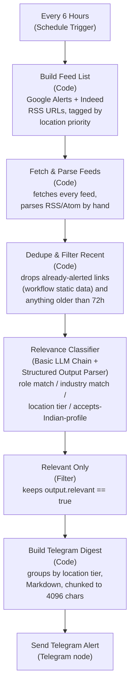

# Job Alert → Telegram Assistant

A no-code [n8n](https://n8n.io) workflow that runs on a schedule, searches for
open roles matching a target profile, uses an LLM to decide which postings are
actually relevant (role, industry, and location fit), and pushes a formatted
digest straight into a Telegram chat — no manual job-board checking.

Built for this profile:
- **Roles**: VP / AVP Account Management *or* VP / AVP Transformation, in Life
  Insurance — **or** Business Head, in Travel & Hospitality.
- **Location priority**: Delhi NCR → rest of India → UAE → Australia → any other
  country that commonly accepts Indian nationals at this seniority.

Everything role- and location-specific lives in two places, so you can retarget
this for a different profile without touching the workflow's structure:
[`n8n/prompts/04_relevance_classifier.md`](n8n/prompts/04_relevance_classifier.md)
(the LLM's screening criteria) and
[`docs/search_queries.md`](docs/search_queries.md) (the search queries feeding it).

## Stack

| Layer | Tool |
|---|---|
| Orchestration / schedule | [n8n](https://n8n.io) (cloud or self-hosted) |
| Job discovery | [Google Alerts](https://www.google.com/alerts) RSS (primary — covers LinkedIn, Naukri, iimjobs, etc.) + Indeed regional RSS (optional secondary) |
| Relevance screening | OpenAI (`gpt-4o-mini` or similar) — swappable for Google Gemini free tier, same as this repo's other project |
| Delivery | [Telegram Bot API](https://core.telegram.org/bots) |

## Architecture



Why this shape:
- **Fetching feeds inside a Code node**, not one RSS Feed Read node per feed —
  n8n can't reliably resolve `$('Build Feed List').item` across a node that
  expands one input item into many outputs (a 1-to-many paired-item boundary),
  so `Fetch & Parse Feeds` fetches and tags every entry itself, keeping the
  originating feed's label attached to each result. See
  [`n8n/prompts/02_fetch_and_parse_feeds.js`](n8n/prompts/02_fetch_and_parse_feeds.js).
- **Dedupe happens before the LLM call**, not after, to avoid re-spending LLM
  tokens re-classifying postings you were already alerted about.
- **Google Alerts is the primary source, not a scraper** — it's officially
  supported, has no rate limits or ToS risk, and indexes far more job boards
  than any single site's own RSS. Indeed's regional RSS is wired in as a bonus
  but treated as optional since its availability has shifted by region over
  time (see [`docs/troubleshooting.md`](docs/troubleshooting.md)).
- **The LLM does the fine-grained filtering**, not the search queries — the
  Google Alerts queries are intentionally broad; precision comes from
  [`04_relevance_classifier.md`](n8n/prompts/04_relevance_classifier.md), which
  is where role/industry/location rules actually live.

## Repo layout

```
job-alert-telegram-assistant/
├── README.md                                  ← you are here
├── n8n/
│   ├── Job_Alert_Telegram_Workflow.json        ← importable n8n workflow
│   └── prompts/                                ← every node's code/prompt, verbatim, for copy-paste or reference
└── docs/
    ├── search_queries.md                       ← Google Alerts setup + exact query strings, Indeed RSS reference
    ├── sample_alert_message.md                 ← what the Telegram message looks like
    └── troubleshooting.md
```

## Setup

### Step 1 — Telegram bot

1. In Telegram, message **[@BotFather](https://t.me/BotFather)** →
   `/newbot` → follow the prompts → copy the **bot token** it gives you
   (looks like `123456789:AAExampleTokenxxxxxxxxxxxxxxxxxxxxxxx`).
2. Search for your new bot by the username you gave it and send it any message
   (e.g. `/start`) — a bot can't message you until you've messaged it first.
3. Get your **chat ID**: open
   `https://api.telegram.org/bot<YOUR_TOKEN>/getUpdates` in a browser right
   after step 2, and read the numeric `"chat":{"id": ...}` value from the JSON
   response. (Alternative: message **[@userinfobot](https://t.me/userinfobot)**
   and it replies with your ID directly.)

### Step 2 — Google Alerts (job discovery)

Follow [`docs/search_queries.md`](docs/search_queries.md) to create the two
Google Alerts (one for Life Insurance VP roles, one for Travel/Hospitality
Business Head roles) with **Deliver to: RSS feed**, and copy each alert's RSS
feed URL.

### Step 3 — n8n workflow

1. Start n8n ([n8n cloud](https://n8n.io) or self-hosted) and create a new
   workflow.
2. **Import** [`n8n/Job_Alert_Telegram_Workflow.json`](n8n/Job_Alert_Telegram_Workflow.json)
   (Workflows → Import from File).
   > **This JSON was hand-authored and not verified against a live n8n
   > instance** (no n8n available in the environment that built this
   > project) — same caveat as this repo's other n8n project. After import you
   > may see a node or two flagged as needing its type re-selected or
   > credentials re-attached; that's expected. If a node fails to import
   > cleanly, rebuild it by hand using its file in `n8n/prompts/` as the source
   > of truth — every prompt and code block there is copy-paste ready.
3. Open the **`Build Feed List`** code node and replace
   `REPLACE_WITH_GOOGLE_ALERTS_RSS_URL_1` / `_2` with the two feed URLs from
   Step 2.
4. Set up credentials:
   - **OpenAI**: Credentials → New → OpenAI API → assign to `OpenAI Chat
     Model`.
   - **Telegram**: Credentials → New → Telegram API → paste your bot token
     from Step 1 → assign to `Send Telegram Alert`.
5. Open **`Send Telegram Alert`** → replace `REPLACE_WITH_YOUR_TELEGRAM_CHAT_ID`
   in the `chatId` field with your chat ID from Step 1.
6. (Optional) Open **`Every 6 Hours`** and adjust the interval — e.g. twice a
   day is plenty given Google Alerts itself batches roughly daily; see
   [`docs/troubleshooting.md`](docs/troubleshooting.md).
7. **Activate** the workflow (toggle top-right). It fires on its own from
   here — no manual "test chat" step needed, though you can still right-click
   → *Execute Workflow* to trigger one run immediately and confirm the
   Telegram message arrives.

### Step 4 — Retargeting for a different profile

Everything specific to this candidate's roles/industries/locations lives in
two files — edit these, not the workflow structure, if priorities change:
- [`n8n/prompts/04_relevance_classifier.md`](n8n/prompts/04_relevance_classifier.md)
  — candidate profile, target role definitions, location tiers.
- [`docs/search_queries.md`](docs/search_queries.md) — the Google Alerts query
  strings and Indeed RSS query parameters.

## The pipeline, node by node

| Node | Type | Code/prompt file |
|---|---|---|
| `Every 6 Hours` | Schedule Trigger | — |
| `Build Feed List` | Code | [`n8n/prompts/01_build_feed_list.js`](n8n/prompts/01_build_feed_list.js) |
| `Fetch & Parse Feeds` | Code | [`n8n/prompts/02_fetch_and_parse_feeds.js`](n8n/prompts/02_fetch_and_parse_feeds.js) |
| `Dedupe & Filter Recent` | Code | [`n8n/prompts/03_dedupe_and_filter_recent.js`](n8n/prompts/03_dedupe_and_filter_recent.js) |
| `Relevance Classifier` | Basic LLM Chain + Structured Output Parser | [`n8n/prompts/04_relevance_classifier.md`](n8n/prompts/04_relevance_classifier.md) |
| `Relevant Only` | Filter | keeps items where `output.relevant == true` |
| `Build Telegram Digest` | Code | [`n8n/prompts/05_build_telegram_digest.js`](n8n/prompts/05_build_telegram_digest.js) |
| `Send Telegram Alert` | Telegram node | sends the final message(s) |

## Sample output

See [`docs/sample_alert_message.md`](docs/sample_alert_message.md) for what a
Telegram alert looks like, grouped by location priority.

## Security & cost notes

- The bot token and chat ID identify a private Telegram chat — keep the n8n
  credential private; anyone with the token can send messages as your bot.
- Each new, deduped posting costs one LLM call (`gpt-4o-mini` pricing is cents
  per hundred calls) — dedupe running *before* the classifier keeps this cost
  bounded to genuinely new postings, not every posting on every run.
- Dedupe is link-based and stored in the workflow's n8n-managed static data —
  see the note in [`docs/troubleshooting.md`](docs/troubleshooting.md) about
  what happens on re-import.
- Google Alerts and Indeed RSS are both public, unauthenticated endpoints —
  no API keys to leak, but also no SLA; treat missed or delayed alerts as a
  possibility, not a guarantee, for anything time-sensitive.

## Deliverables checklist

- [x] Scheduled n8n workflow covering discovery → dedupe → LLM relevance
      screening → Telegram delivery (`n8n/`)
- [x] Profile-specific search queries and screening criteria, isolated from
      workflow structure for easy retargeting (`docs/search_queries.md`,
      `n8n/prompts/04_relevance_classifier.md`)
- [x] Documentation: Telegram bot setup, Google Alerts setup, import steps,
      troubleshooting guide (this file + `docs/`)
