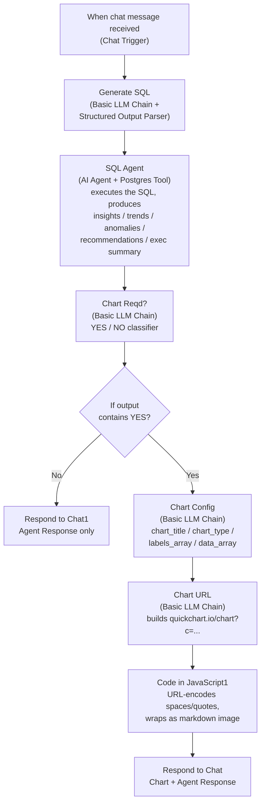

# Sales & Marketing Insight Assistant

A no-code, conversational analytics assistant built in [n8n](https://n8n.io). Non-technical
business users type questions like *"Show me leads by region"* or *"Which campaign performed
best?"* into a chat window and get back an LLM-generated SQL query, live data pulled from
Postgres, a natural-language summary with key insights and recommendations, and — when useful —
a chart, with no manual analysis required.

Built from the *"PROJECT 1: Sales & Marketing Insight Assistant"* brief (TalentSprint / Accenture).

## Stack

| Layer | Tool |
|---|---|
| Orchestration | [n8n](https://n8n.io) (cloud or self-hosted) |
| LLM reasoning / NLQ→SQL / insights | OpenAI (`gpt-4o-mini` or similar) — swappable for Google Gemini free tier (`gemini-2.5-flash`) |
| Database | PostgreSQL via [Supabase](https://supabase.com) |
| Charts | [QuickChart](https://quickchart.io) |

## Architecture



Why this shape, not a single freeform agent: the chart-required decision is made by a dedicated
classifier step so the pipeline is predictable (agents can silently skip steps), and SQL execution
is delegated to the AI Agent's Postgres **tool** rather than a plain Postgres node so the agent can
retrieve, re-check, and reason over the data before writing its insight summary.

## Repo layout

```
sales-marketing-insight-assistant/
├── README.md                                    ← you are here
├── n8n/
│   ├── Sales_Marketing_Insight_Pipeline.json     ← importable n8n workflow
│   └── prompts/                                  ← every node's prompt/code, verbatim, for copy-paste or reference
├── sql/
│   ├── schema.sql                                ← sales_marketing table definition
│   └── seed_data.sql                             ← synthetic sample data (160 rows)
└── docs/
    ├── sample_insight_reports.md                 ← worked example Q&A transcripts
    └── troubleshooting.md
```

## Setup

### Step 1 — Supabase (PostgreSQL database)

1. Create a free account/project at [supabase.com](https://supabase.com) (Organization → Personal
   → Free plan; Project name e.g. `My Project`, pick a region, set a DB password).
2. Open the **SQL Editor** and run, in order:
   - [`sql/schema.sql`](sql/schema.sql) — creates the `sales_marketing` table.
   - [`sql/seed_data.sql`](sql/seed_data.sql) — loads 160 rows of synthetic sample data (20
     campaigns × 8 months, all 4 regions, all 6 channels). If you have the original
     TalentSprint-provided `Sales_Marketing_Data.csv`, you can instead use Supabase's **Table
     Editor → New table → Import data from CSV** and skip this file — just make sure
     `campaign_id` ends up as the primary key.
3. Click **Connect** on the project → *Connection String* tab → Type `PSQL` → Method
   **Session Pooler** → note the host, port, database, and user (`postgres.<project-ref>`); you'll
   enter these plus your DB password as an n8n Postgres credential in Step 2.
4. **Recommended:** create a read-only database role for n8n to use instead of the default
   `postgres` superuser, since the AI Agent in this workflow has live query-execution access:
   ```sql
   create role analytics_readonly with login password 'CHANGE_ME_STRONG_PASSWORD';
   grant usage on schema public to analytics_readonly;
   grant select on all tables in schema public to analytics_readonly;
   alter default privileges in schema public grant select on tables to analytics_readonly;
   ```
   Use `analytics_readonly` (not `postgres`) as the n8n Postgres credential's user.

### Step 2 — n8n workflow

1. Start n8n ([n8n cloud](https://n8n.io) or self-hosted) and create a new workflow, e.g. named
   *Sales & Marketing Insight Pipeline*.
2. **Import** [`n8n/Sales_Marketing_Insight_Pipeline.json`](n8n/Sales_Marketing_Insight_Pipeline.json)
   (Workflows → Import from File).
   > **This JSON was hand-authored and not verified against a live n8n instance** (no n8n/Supabase
   > available in the environment that built this project). n8n's AI/LangChain node type strings
   > and versions change between releases, so after import you may see a few nodes flagged as
   > needing their type re-selected or credentials re-attached — that's expected, not a sign the
   > project is broken. If a node fails to import cleanly, rebuild just that node by hand using its
   > prompt file in `n8n/prompts/` as the source of truth; every prompt, expression, and node
   > setting documented there is copy-paste ready. See `docs/troubleshooting.md`.
3. Set up credentials:
   - **OpenAI**: Credentials → New → OpenAI API, paste your key from
     [platform.openai.com](https://platform.openai.com). Assign it to all `OpenAI Chat Model*`
     nodes (5 of them).
   - **Postgres**: Credentials → New → Postgres, using the Supabase host/port/database/user
     (`analytics_readonly` if you created it) and password from Step 1. Assign it to the
     `Execute a SQL query in Postgres` tool node.
4. Open the `When chat message received` node → confirm **Response Mode = "Using Response
   Nodes"** (required because `Respond to Chat` / `Respond to Chat1` send the final message).
5. Click **Test chat** and try: *"Show me leads by region"*.

### Step 3 — Swapping OpenAI → Google Gemini (free tier)

Every `OpenAI Chat Model*` node can be swapped for a **Google Gemini Chat Model** node (model
`gemini-2.5-flash` or similar) with a Google AI credential from
[aistudio.google.com](https://aistudio.google.com) — same connection points (`ai_languageModel`),
no other node needs to change. Mix and match if you like (e.g. cheaper Gemini for the SQL/chart
formatting steps, OpenAI for the insight-generation agent).

## The pipeline, node by node

| Node | Type | Prompt/code file |
|---|---|---|
| `When chat message received` | Chat Trigger | — |
| `Generate SQL` | Basic LLM Chain + Structured Output Parser | [`n8n/prompts/01_generate_sql.md`](n8n/prompts/01_generate_sql.md) |
| `SQL Agent` | AI Agent + Postgres Tool | [`n8n/prompts/02_sql_agent_insights.md`](n8n/prompts/02_sql_agent_insights.md) |
| `Chart Reqd?` | Basic LLM Chain | [`n8n/prompts/03_chart_required.md`](n8n/prompts/03_chart_required.md) |
| `If` | IF node | routes on `{{$json.text}}` containing "YES" |
| `Chart Config` | Basic LLM Chain | [`n8n/prompts/04_chart_config.md`](n8n/prompts/04_chart_config.md) |
| `Chart URL` | Basic LLM Chain | [`n8n/prompts/05_chart_url.md`](n8n/prompts/05_chart_url.md) |
| `Code in JavaScript1` | Code node | [`n8n/prompts/06_code_update_chart_url.js`](n8n/prompts/06_code_update_chart_url.js) |
| `Respond to Chat` / `Respond to Chat1` | Respond to Chat | sends the final chat message |

## Testing

Run these example questions in the Test Chat panel end-to-end:

- **"Show me leads by region"** — expect a `GROUP BY region` query, a chart-required = YES
  classification, a bar chart, and a summary calling out North as the strongest region.
- **"Which campaign performed best?"** — expect an `ORDER BY` on ROAS or conversions/spend, and a
  summary naming the top campaign by return on ad spend.
- **"Show the sales number market wise"** — "market" maps to the `region` column; expect a
  `GROUP BY region` query on `sales_revenue` (not leads this time), a pie/doughnut or bar chart,
  and a summary naming North as the top market at ~29.7% of total revenue.

Confirm the final chat message contains: the generated SQL (via the agent's response), key
insights, an executive summary, recommendations, and — for these questions — a chart image
link.

See [`docs/sample_insight_reports.md`](docs/sample_insight_reports.md) for worked-example
transcripts (SQL + insight text + chart URL) illustrating expected output shape against the
seed dataset.

## Security notes

- The AI Agent executes whatever SQL `Generate SQL` produces via a live Postgres tool — always
  point the Postgres credential at a **read-only** role (Step 1.4), not the Supabase project's
  default superuser.
- QuickChart's public API (`quickchart.io`) receives your chart data over HTTPS to render the
  image — don't chart anything containing PII or regulated data on the free/public tier; QuickChart
  offers a self-hostable version if that's a requirement.
- The Chat Trigger's public test/production URL has no built-in rate limiting — put it behind
  n8n's workflow-level rate limiting or an API gateway before sharing broadly.

## Deliverables checklist (per the project brief)

- [x] n8n workflow pipeline covering input → SQL → insights → charts → delivery (`n8n/`)
- [x] Sample insight reports: top campaigns, regional breakdowns, spend vs. conversions, monthly
      trends (`docs/sample_insight_reports.md`)
- [x] Documentation: setup steps, DB connection guidelines, example questions, troubleshooting
      guide (this file + `docs/troubleshooting.md`)
